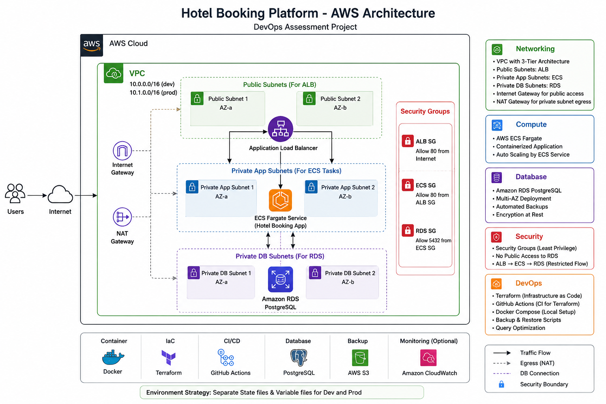

# 🚀 DevOps Assessment - Terraform + Database Reliability


A production-inspired DevOps assessment demonstrating Infrastructure as Code (Terraform), AWS architecture design, Docker Compose, PostgreSQL database management, backup & restore automation, and CI validation using GitHub Actions.

---

# 📌 Project Overview

This project demonstrates how a modern cloud-native application infrastructure can be designed using Terraform while following production-oriented DevOps practices.

The infrastructure follows a secure three-tier architecture:

- Internet → Application Load Balancer
- ALB → ECS Fargate Service
- ECS → Amazon RDS PostgreSQL
- RDS deployed in private database subnets
- Infrastructure separated into reusable Terraform modules
- Separate Development and Production environments
- Local PostgreSQL environment for database validation
- Automated backup & restore scripts
- Query optimization using PostgreSQL indexes
- GitHub Actions workflow for Terraform validation

> **Note**
>
> This repository is intended as an infrastructure design assessment.
> AWS deployment is intentionally not applied.
> Infrastructure has been validated using:
>
> - terraform fmt
> - terraform validate
> - terraform plan

---

# 🏗 Architecture



---

# 🏛 High-Level Architecture

```
                    Internet
                        │
                        ▼
        Application Load Balancer (Public)

                        │
                        ▼
              ECS Fargate Service

                        │
                        ▼
             Amazon RDS PostgreSQL

              (Private Subnets)
```

---

# ✨ Key Features

## Infrastructure

- Terraform Infrastructure as Code
- Reusable Terraform Modules
- VPC with Public & Private Subnets
- Internet Gateway
- NAT Gateway
- Application Load Balancer
- ECS Fargate Cluster
- Amazon RDS PostgreSQL
- Security Group Isolation
- Development & Production Environments

---

## Database

- PostgreSQL 16
- Docker Compose
- SQL Migrations
- Seed Data
- Booking Events
- Query Optimization
- Composite Index
- Backup Script
- Restore Script

---

## DevOps

- GitHub Actions
- Infrastructure Validation
- Environment Separation
- Modular Terraform Design
- Infrastructure Planning
- Production-inspired Repository Structure

---

# 📂 Repository Structure

```
devops-assessment/

├── .github/
│   └── workflows/
│       └── terraform.yml
│
├── database/
│   ├── migrations/
│   ├── seeds/
│   └── indexes/
│
├── docs/
│   └── architecture.png
│
├── infra/
│
│   ├── modules/
│   │
│   │   ├── network/
│   │   ├── security/
│   │   ├── ecs/
│   │   └── rds/
│   │
│   └── envs/
│       ├── dev/
│       └── prod/
│
├── scripts/
│   ├── backup.sh
│   └── restore.sh
│
├── docker-compose.yml
├── Makefile
└── README.md
```

---

# 🛠 Technologies Used

| Category | Technology |
|----------|------------|
| Cloud | AWS |
| IaC | Terraform |
| Container | Docker Compose |
| Database | PostgreSQL 16 |
| Compute | ECS Fargate |
| Networking | VPC, ALB, NAT Gateway |
| CI | GitHub Actions |
| Version Control | Git & GitHub |


---

# 🌍 Environment Configuration

The infrastructure is organized into separate environments to follow production DevOps practices.

| Configuration | Development | Production |
|--------------|-------------|------------|
| Environment | dev | prod |
| VPC CIDR | 10.0.0.0/16 | 10.1.0.0/16 |
| RDS Instance | db.t3.micro | db.t3.small |
| Backup Retention | 3 Days | 30 Days |
| Deletion Protection | Disabled | Enabled |

Using separate environments allows infrastructure to be configured independently while reusing the same Terraform modules.

---

# 🏗 Terraform Infrastructure

The AWS infrastructure is organized into reusable Terraform modules.

## Network Module

The network module provisions:

- Virtual Private Cloud (VPC)
- Public Subnets
- Private Application Subnets
- Private Database Subnets
- Internet Gateway
- NAT Gateway
- Public & Private Route Tables

This modular approach improves reusability and maintainability.

---

## Security Module

Dedicated security groups are created for:

- Application Load Balancer
- ECS Fargate Service
- Amazon RDS PostgreSQL

Traffic Flow

```
Internet
      │
      ▼
Application Load Balancer
      │
      ▼
 ECS Fargate Tasks
      │
      ▼
 Amazon RDS
```

The RDS instance is deployed in private subnets and only accepts traffic from the ECS security group.

---

## ECS Module

The ECS module provisions:

- ECS Cluster
- Task Definition
- ECS Service
- Application Load Balancer
- Target Group
- Listener

Container Image:

```
nginx:latest
```

The application runs inside ECS Fargate without requiring EC2 instances.

---

## RDS Module

The RDS module provisions:

- PostgreSQL Database
- DB Subnet Group
- Parameter Group
- Security Group Integration
- Backup Retention
- Deletion Protection

Production configuration enables longer backup retention and deletion protection.

---

# 🐳 Local Database

A local PostgreSQL environment is created using Docker Compose.

Features

- PostgreSQL 16
- Named Volume
- Health Check
- Automatic Restart Policy

Start Database

```bash
docker compose up -d
```

Verify

```bash
docker ps
```

Connect

```bash
docker exec -it hotel-postgres psql -U postgres -d hoteldb
```

---

# 🗄 Database Schema

The project contains two tables.

## hotel_bookings

Stores booking information.

Columns include:

- Booking ID
- Organization ID
- Hotel ID
- City
- Check-in Date
- Check-out Date
- Amount
- Status
- Created Timestamp

---

## booking_events

Stores booking lifecycle events.

Each event references a booking using a foreign key.

The payload is stored as JSONB to support flexible event data.

---

# 🌱 Seed Data

The database is automatically populated with sample data.

Included Data

- 100 Hotel Bookings
- 50 Booking Events
- Multiple Cities
- Multiple Organizations
- Multiple Booking Statuses

The seed script uses PostgreSQL's `generate_series()` and `gen_random_uuid()` functions to generate repeatable sample data.

---

# ⚡ Query Optimization

The following reporting query was optimized.

```sql
SELECT
    org_id,
    status,
    COUNT(*),
    SUM(amount)
FROM hotel_bookings
WHERE city = 'delhi'
  AND created_at >= NOW() - INTERVAL '30 days'
GROUP BY org_id, status;
```

## Optimization Strategy

A composite index was created on:

```
(city, created_at, org_id, status)
```

Reason:

- Filters on `city`
- Filters on `created_at`
- Groups by `org_id`
- Groups by `status`

The query execution plan was verified using:

```sql
EXPLAIN ANALYZE
```

With the current sample dataset (100 rows), PostgreSQL correctly chooses a Sequential Scan because scanning a small table is cheaper than traversing an index.

On production-sized datasets, the composite index is expected to significantly reduce the number of scanned rows and improve query performance.

---

# 💾 Backup and Restore

Database reliability is demonstrated through automated backup and restore scripts.

## Backup

Create a timestamped PostgreSQL database backup.

```bash
./scripts/backup.sh
```

Example Output

```text
Backup completed successfully.

Backup file:

backups/hoteldb_20260706_164913.sql
```

The script:

- Creates the backups directory if it does not exist.
- Uses `pg_dump` to create a logical database backup.
- Generates timestamped backup files to avoid overwriting previous backups.

---

## Restore

Restore the database from a previously created backup.

```bash
./scripts/restore.sh backups/<backup_file>.sql
```

The restore process recreates:

- Tables
- Constraints
- Sequences
- Indexes
- Seed Data

The restore procedure was verified by:

1. Dropping existing tables.
2. Restoring the backup.
3. Confirming that the database objects and records were recreated successfully.

---

# 🤖 GitHub Actions

A GitHub Actions workflow is included to validate Terraform changes.

Workflow Steps

- Terraform Format Check
- Terraform Initialization
- Terraform Validation
- Terraform Plan

The workflow is configured to run on Pull Requests before infrastructure changes are merged.

This provides an automated quality gate for Infrastructure as Code.

---

# 🚀 Getting Started

## Clone Repository

```bash
git clone https://github.com/robyy07/devops-assessment.git

cd devops-assessment
```

---

## Terraform Validation

Development Environment

```bash
cd infra/envs/dev

terraform init

terraform fmt -recursive

terraform validate

terraform plan
```

Production Environment

```bash
cd infra/envs/prod

terraform init

terraform fmt -recursive

terraform validate

terraform plan
```

---

## Start PostgreSQL

```bash
docker compose up -d
```

Verify

```bash
docker ps
```

---

## Run Database Migration

```bash
docker exec -i hotel-postgres \
psql -U postgres -d hoteldb \
< database/migrations/001_create_tables.sql
```

---

## Seed Database

```bash
docker exec -i hotel-postgres \
psql -U postgres -d hoteldb \
< database/seeds/001_seed_data.sql

docker exec -i hotel-postgres \
psql -U postgres -d hoteldb \
< database/seeds/002_booking_events.sql
```

---

## Create Index

```bash
docker exec -i hotel-postgres \
psql -U postgres -d hoteldb \
< database/indexes/001_query_optimization.sql
```

---

# ✅ Verification

Terraform

```bash
terraform fmt -recursive

terraform validate

terraform plan
```

Database

```sql
SELECT COUNT(*)
FROM hotel_bookings;
```

Expected

```text
100
```

Booking Events

```sql
SELECT COUNT(*)
FROM booking_events;
```

Expected

```text
50
```

Backup

```bash
./scripts/backup.sh
```

Restore

```bash
./scripts/restore.sh backups/<backup_file>.sql
```

---

# 📸 Screenshots

The following screenshots are recommended for repository documentation.

- AWS Architecture Diagram
- Terraform Plan
- Docker Compose Running
- PostgreSQL Tables
- Backup Script Output
- Restore Script Output

---

# 🔮 Future Improvements

Possible production enhancements include:

- Store Terraform state in Amazon S3.
- Enable DynamoDB state locking.
- Store database credentials in AWS Secrets Manager.
- Configure ECS Auto Scaling.
- Enable CloudWatch monitoring and alarms.
- Use ACM certificates with HTTPS.
- Deploy infrastructure using a CI/CD pipeline.
- Add Blue/Green deployment support.

---

# 📚 Key Learnings

This project demonstrates practical experience with:

- Terraform module design
- AWS networking fundamentals
- ECS Fargate architecture
- Amazon RDS security
- Docker Compose
- PostgreSQL administration
- SQL migrations
- Database backup & restore
- Query optimization
- GitHub Actions CI

---

# 💻 Author

**M. Robinson**

DevOps | AWS | Terraform | Docker | Kubernetes | PostgreSQL

GitHub:

https://github.com/robyy07

---

# 📄 License

This repository was created as part of a DevOps technical assessment and is intended for demonstration and learning purposes.
